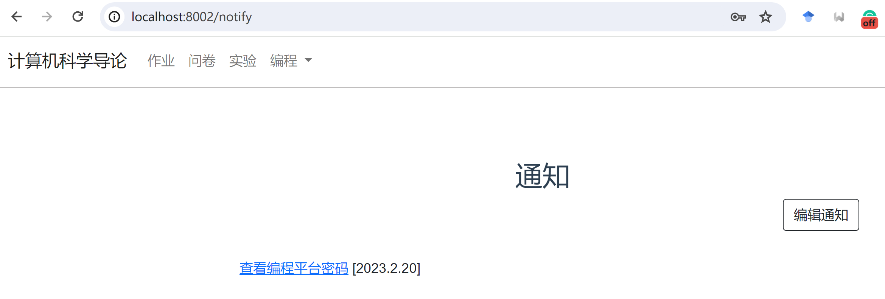

本文档介绍了learnX的部署方法。

## 1. 环境配置
- 配置前端：
  打开文件夹workspace/.env.production，修改VUE_APP_URL为后端服务URI, VUE_APP_FRONT_URL为前端服务URI。
  假如要部署的前端URI是'https://cs101.ucas.ac.cn:7002', 后端URI是'https://cs101.ucas.ac.cn:7001'，则修改.env.production为：
```
    VUE_APP_URL='https://cs101.ucas.ac.cn:7001'
    VUE_APP_FRONT_URL='https://cs101.ucas.ac.cn:7002'
```

- 配置后端：
  打开文件夹workspace/config.py, 根据config.py中的TODO提示，设置需要创建的用户名和密码。

## 2. 启动编程环境

- 根据container_manager中的README.md通过脚本创建容器
- 请把container_manager/config/accounts.json复制到workspace/platform文件夹下
- 执行nginx配置脚本，生成nginx配置项，用在第4步配置中。

## 3. 启动服务

learnX的服务分为前端和后端两部分，打包到了一个容器中。使用以下命令启动容器（把PATH_TO_WORKSPACE修改为本地机器上的workspace路径）。后端服务会在7001端口启动，前端服务会在7002端口启动。
```
    docker run -it -v PATH_TO_WORKSPACE:/workspace -p 7001:7001 -p 7002:7002 lucaszy/learnx:latest /init.sh
```

## 4. 发布到公网

可以使用nginx等工具，将7001和7002端口映射到公网端口。具体步骤请参考对应工具的文档：[nginx文档](https://nginx.org/en/docs/)。
workspace/example/给出了nginx配置文件的例子，nginx.conf_ssl是https的配置文件，nginx.conf_是http的配置文件。请根据自己的情况修改配置文件中的IP地址和端口号。
生产环境下请使用https。

## 5. 平台使用

请访问前端URI，例如'https://cs101.ucas.ac.cn:7002'，使用第二步中设置的teacher账号登录。登录成功后可看到如下界面。
    


    
